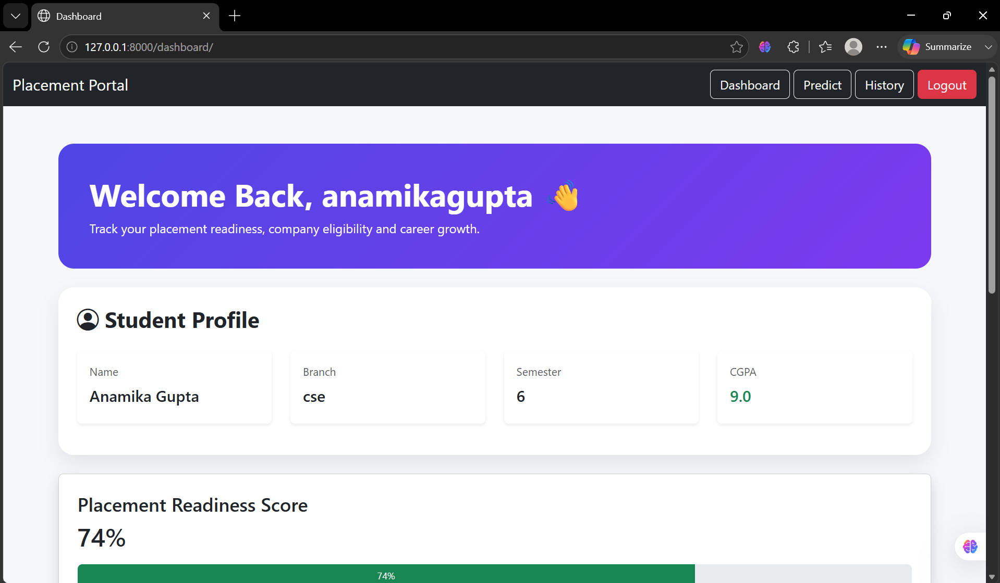
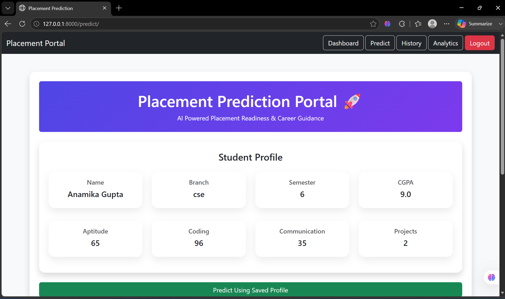
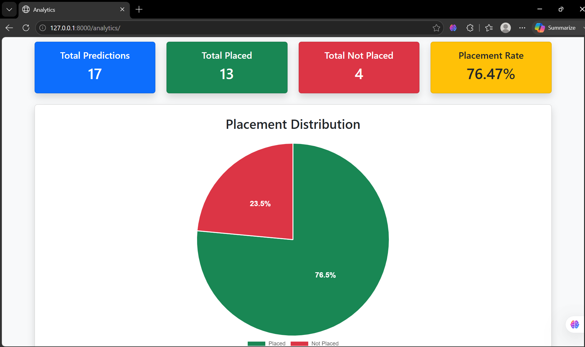
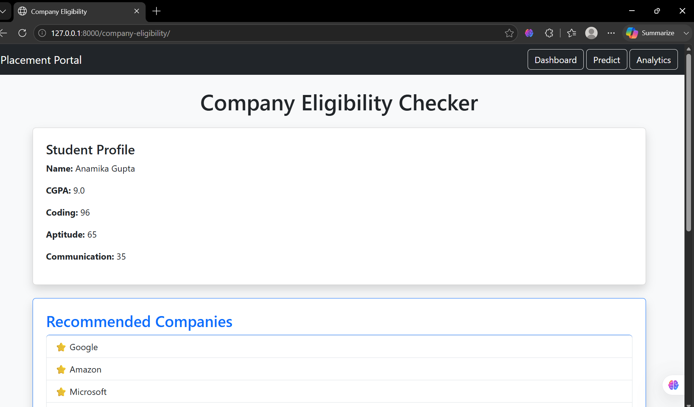
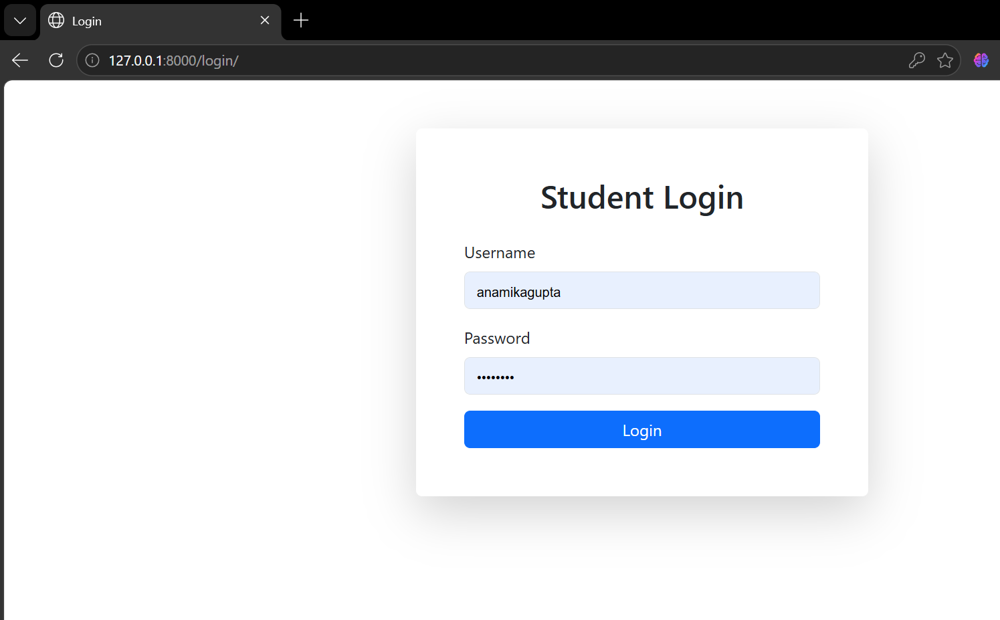

# Placement Prediction & Career Guidance Portal

## Overview

Placement Prediction & Career Guidance Portal is a web-based application developed using Django that helps students evaluate their placement readiness based on academic performance and skill parameters. The system predicts placement chances, analyzes strengths and weaknesses, recommends career paths, checks company eligibility, and provides placement analytics through an interactive dashboard.

---

## Features

### Student Profile Management

* Create and update student profiles
* Store academic and skill-related information
* Track CGPA, aptitude, coding, communication, and projects

### Placement Prediction

* Predict placement status using student performance data
* Calculate placement readiness score
* Display placement probability percentage

### Company Eligibility Checker

* Check eligibility for companies based on predefined criteria
* View eligible and non-eligible companies
* Get company recommendations based on coding skills

### Career Guidance

* Analyze strengths and areas for improvement
* Recommend career paths based on skill levels
* Generate personalized improvement roadmap

### Analytics Dashboard

* Total predictions made
* Total placed students
* Total non-placed students
* Placement rate statistics
* Placement distribution chart
* Recent prediction records

### Prediction History

* Store previous prediction results
* Track prediction dates and scores
* View historical placement analysis

### PDF Report Generation

* Download placement readiness report
* Includes profile information and readiness score
* Portable and shareable report format

### User Authentication

* Secure registration and login
* User-specific profile management
* Session-based authentication

---

## Tech Stack

### Backend

* Python
* Django

### Frontend

* HTML
* CSS
* Bootstrap 5
* Bootstrap Icons

### Database

* SQLite

### Data Visualization

* Chart.js

### Report Generation

* ReportLab (PDF)

---

## Project Structure

PlacementPortal/

├── students/

├── templates/

├── static/

├── db.sqlite3

├── manage.py

└── requirements.txt

---

## Installation

### Clone Repository

```bash
git clone https://github.com/anamika397/placement-prediction-portal.git
```

### Navigate to Project

```bash
cd placement-prediction-portal
```

### Create Virtual Environment

```bash
python -m venv venv
```

### Activate Virtual Environment

Windows:

```bash
venv\Scripts\activate
```

### Install Dependencies

```bash
pip install -r requirements.txt
```

### Run Migrations

```bash
python manage.py migrate
```

### Start Server

'''bash
python manage.py runserver
'''
### Open Browser

```text
http://127.0.0.1:8000/
```

---

## Screenshots

### Dashboard


### Prediction


### Analytics


### Company Eligibility


### Login


## Key Functionalities

* Placement Readiness Analysis
* Placement Probability Calculation
* Career Recommendation System
* Company Eligibility Evaluation
* Prediction History Tracking
* Analytics Visualization
* PDF Report Generation

---

## Future Enhancements

* Machine Learning-based prediction model
* Resume Analyzer
* Interview Preparation Module
* Company Job Notifications
* Student Ranking System
* Email Report Generation
* Admin Dashboard
* Cloud Database Integration

---

## Learning Outcomes

Through this project, I gained practical experience in:

* Django Web Development
* Database Design
* User Authentication
* CRUD Operations
* Data Visualization
* PDF Generation
* Responsive UI Design
* Git & GitHub Version Control

---

## Author

Anamika Gupta

GitHub: https://github.com/anamika397


